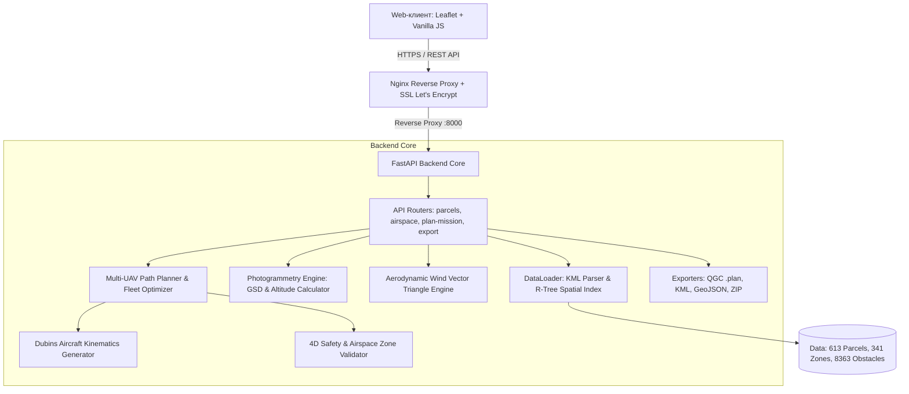

# 🛰️ GEOSCAN FleetCommander AI
**Интеллектуальная система планирования и оптимизации групповых беспилотных авиационных работ для БВС АО «Геоскан»**

Разработано для компании **АО «Геоскан»** в рамках хакатона «Лидеры Цифровой Трансформации 2026».

---

## 📑 Содержание

1. [Обзор продукта и назначение](#-1-обзор-продукта-и-назначение)
2. [Ключевые фичи и возможности](#-2-ключевые-фичи-и-возможности)
3. [Архитектура решения](#-3-архитектура-решения)
4. [Последовательный математический алгоритм](#-4-последовательный-математический-алгоритм)
5. [Сильные стороны и конкурентные преимущества](#-5-сильные-стороны-и-конкурентные-преимущества)
6. [Проблемы в процессе разработки и их решения](#-6-проблемы-в-процессе-разработки-и-их-решения)
7. [Инструкция по развертыванию и запуску (Local & Docker)](#-7-инструкция-по-развертыванию-и-запуску)
8. [Инструкция по автоматизированному тестированию](#-8-инструкция-по-автоматизированному-тестированию)
9. [Чек-лист ручного тестирования (Manual QA)](#-9-чек-лист-ручного-тестирования-manual-qa)
10. [Продакшн инфраструктура и ссылки](#-10-продакшн-инфраструктура-и-ссылки)

---

## 🚁 1. Обзор продукта и назначение

**GEOSCAN FleetCommander AI** — это программный комплекс корпоративного уровня для автоматизированного планирования, координации и оптимизации аэрофотосъемочных (АФС) и лазерных сканирующих миссий для гетерогенного флота БВС «Геоскан».

### Поддерживаемый флот БВС «Геоскан»:
* **Геоскан 201** — БВС самолетного типа дальнего действия для сверхбольших площадей (размах 2.2 м, крейсерская скорость 21 м/с, время полета до 180 мин, радиус виража 85 м).
* **Геоскан 701** — флагманский самолет повышенной автономности для площадной и линейной аэрофотосъемки.
* **Геоскан 801** — промышленный мультироторный комплекс высокой грузоподъемности для детальной инспекции и лидаров.
* **Геоскан 401** — среднеразмерный мультиротор для геодезических работ и точного земледелия.
* **Геоскан 101** — легкий самолет быстрого развертывания.
* **Геоскан Gemini** — компактный квадрокоптер для оперативного картографирования.

### Поддерживаемые полезные нагрузки:
* **Sony RX1RM2** (42.4 Мп, фокус 35 мм, полнокадровая геодезическая съемка)
* **Sony A6000** (24.3 Мп, фокус 20 мм, APS-C)
* **Sony ILX-LR1** (61.0 Мп, сверхвысокое разрешение)
* **Лидар AGM-MS3** (лазерное сканирование высокой плотности)
* **Мультиспектральная камера RedEdge-P** (агромониторинг и NDVI)

---

## ⚡ 2. Ключевые фичи и возможности

* **Интерактивная Web-GIS консоль**: темная тема с акцентами в стиле Flight Control Center, плавная картография Leaflet, отображение полигонов, зон и рельефных препятствий.
* **Поддержка кастомных полигонов**: возможность нарисовать произвольный полигон любой формы или загрузить участок из базы (613 кадастровых и лесоустроительных участков).
* **Метеомодель и ветроучет**: интерактивный селектор ветра (скорость и азимут), корректная индикация навигационного и метеорологического направления.
* **4D-симулятор миссии**: интерактивный плеер со шкалой времени (Time Scrubbing), синхронной визуализацией параллельного полета бортов, реалистичным курсовым углом (Heading) и скоростью.
* **Реалистичная аварийная траектория**: генерация экстренного схода на площадку посадки с соблюдением радиуса виража, плавной глиссады снижения и обхода препятствий.
* **Двойной критерий оптимизации**:
  1. *Минимизация общего времени (Makespan)* — максимальное распараллеливание флота для завершения всей задачи в кратчайший срок.
  2. *Минимизация суммарного налета (Total Flight Time)* — экономия ресурса двигателей и аккумуляторов.
* **Кроссплатформенный промышленный экспорт**:
  - **QGroundControl `.plan`** — готовый полетный план с WGS84-координатами, скоростями, высотами и безопасными параметрами.
  - **KML** — трехмерные траектории для Google Earth.
  - **GeoJSON** — векторные слои для интеграции с внешними корпоративными ГИС.
  - Поддержка одиночной выгрузки и ZIP-архива для группового вылета флота.

---

## 🏛️ 3. Архитектура решения

Решение построено по принципам модульной микросервисной архитектуры с четким разделением слоев:



### Модули бэкенда:
* `backend/models.py`: Pydantic-модели валидации данных, каталоги ТТХ БВС и полезных нагрузок.
* `backend/data_loader.py`: высокопроизводительная загрузка KML геометрий, парсер вертикальных эшелонов зон и пространственный индекс `R-Tree` (Shapely STRtree).
* `backend/photogrammetry.py`: фотограмметрические зависимости (GSD, фокусное расстояние, физический размер пикселя, расчет базы фотографирования $B_x$ и ширины захвата $D_{\text{swath}}$).
* `backend/wind_math.py`: расчет путевой скорости, угла сноса (Crab angle) и поправки энергопотребления от встречно-бокового ветра.
* `backend/path_planner.py`: ядро алгоритма — нарезка галсов (Boustrophedon), кинематические траектории, динамический срез площади под батарею, многобортовое расписание.
* `backend/exporters.py`: сериализаторы в стандартные форматы беспилотной авиации.

---

## 📐 4. Последовательный математический алгоритм

Весь процесс планирования выполняется строго детерминированно в 9 математических этапов:

### Шаг 1. Фотограмметрический расчет рабочей высоты и шага съемки
По заданному требуемому разрешению на местности ($GSD$, м/пикс), физическому размеру матрицы ($S_w, S_h$, мм), размеру пикселя ($s_p$, мкм) и фокусному расстоянию объектива ($F$, мм):
$$H_{\text{rel}} = \frac{F \cdot GSD}{s_p}$$
Ширина и длина кадра на местности:
$$W_{\text{ground}} = \frac{H_{\text{rel}} \cdot S_w}{F}, \quad L_{\text{ground}} = \frac{H_{\text{rel}} \cdot S_h}{F}$$
Шаг между съемочными галсами с учетом бокового перекрытия $p_{\text{side}}$:
$$D_{\text{swath}} = W_{\text{ground}} \cdot (1 - p_{\text{side}})$$
Базис фотографирования вдоль галса с учетом продольного перекрытия $p_{\text{forward}}$:
$$B_x = L_{\text{ground}} \cdot (1 - p_{\text{forward}})$$

### Шаг 2. Проекция координат в метрическое пространство
Исходные координаты полигона $WGS84$ (долгота/широта) проецируются в локальную конформную проекцию UTM (WGS 84 / UTM zone) через библиотеку `pyproj`. Это обеспечивает нулевые искажения метрических расстояний при нарезке галсов и расчете площадей.

### Шаг 3. Аэродинамика ветра и выбор азимута съемки
Вектор ветра $\vec{W} = (W_x, W_y)$ взаимодействует с вектором воздушной скорости БВС $\vec{V}_{\text{air}}$:
$$\vec{V}_{\text{ground}} = \vec{V}_{\text{air}} + \vec{W}$$
Угол упреждения сноса (Crab angle $\delta$):
$$\delta = \arcsin\left(-\frac{W \cdot \sin(\theta_{\text{track}} - \psi_{\text{wind}})}{V_{\text{air}}}\right)$$
Путевая скорость на участке:
$$V_{\text{ground}} = V_{\text{air}} \cdot \cos(\delta) + W \cdot \cos(\theta_{\text{track}} - \psi_{\text{wind}})$$
*Выбор оптимального азимута галсов*: алгоритм ориентирует съемочные проходы преимущественно параллельно или навстречу доминирующему вектору ветра. Это минимизирует паразитный крен крыла (что критично для сохранения геодезической точности фотограмметрии) и снижает время на развороты.

### Шаг 4. Boustrophedon Sweep с сохранением внутренних контуров
1. Полигон поворачивается на угол $-\alpha$, приводя галсы к параллели с осью абсцисс.
2. Проводится семейство секущих прямых с шагом $D_{\text{swath}}$.
3. Вычисляется пересечение прямых с полигоном ($\text{LineString} \cap \text{Polygon}$). При наличии внутренних вырезов (no-fly zones, озера, запретные объекты) линия корректно фрагментируется на валидные отрезки.
4. Концы отрезков возвращаются обратным поворотом на $+\alpha$.

### Шаг 5. Построение оптимального порядка обхода галсов
- Для $N \le 9$ проходов: запускается точное динамическое программирование (Held-Karp algorithm) для задачи TSP с фиксированными концами, находящее абсолютно кратчайший маршрут обхода.
- Для $N > 9$: применяется жадный алгоритм ближайшего соседа с локальной оптимизацией 2-Opt.

### Шаг 6. Кинематика разворотов (Кривые Дубинса) для самолетного типа
Для самолетов (Геоскан 201 / 701) соединение концов двух соседних галсов под прямым или острым углом физически невозможно.
Минимальный радиус виража определяется предельно допустимым углом крена $\phi_{\max} = 30^\circ$:
$$R_{\min} = \frac{V_{\text{air}}^2}{g \cdot \tan(\phi_{\max})} \approx 85\text{ м}$$
Между выходом из галса $\vec{T}_{\text{exit}}$ и входом в следующий $\vec{T}_{\text{entry}}$ генерируется сглаженная траектория типа CSC (Circle-Straight-Circle) или CCC (Circle-Circle-Circle) из аналитических примитивов Дубинса.

### Шаг 7. Распределение флота и динамический срез площади (Battery Clipping)
Если в миссии задействовано несколько БВС с разным уровнем заряда аккумулятора $B_i \in [0, 100]\%$:
1. Каждый борт получает допустимый энергетический лимит дальности $L_i = V_{\text{air}} \cdot T_{\text{max}} \cdot \frac{B_i - B_{\text{reserve}}}{100}$.
2. Вместо дисквалификации борта с пониженным зарядом (например, 40%) система производит пропорциональный геометрический срез площади полигона.
3. БВС с 40% батареи закрывает ровно ту часть галсов, на которую гарантированно хватает энергии с запасом 20% на возвращение к базе, а оставшуюся часть забирает полностью заряженный напарник.

### Шаг 8. Траектория аварийного схода (Emergency Diversion)
В точке симуляции отказа:
1. Вычисляется текущий вектор скорости и пространственная ориентация БВС.
2. По касательной к текущей траектории без недопустимых скачков перегрузки строится дуга выхода в направлении назначенной точки аварийной посадки (или взлетно-посадочной полосы).
3. Высота плавно снижается по безопасной глиссаде с учетом высоты препятствий под траекторией снижения.

### Шаг 9. Пространственная 4D-валидация
Каждый построенный сегмент маршрута проходит проверку через `R-Tree` индекс:
- Препятствия: проверка пересечения с цилиндрическим буфером безопасности $R_{\text{buf}} = 50\text{ м}$ и высотой препятствия $H_{\text{obs}} + 25\text{ м}$.
- Зоны ограничений: проверка попадания в запретные зоны только в том случае, если диапазон высот зоны $[H_{\min}, H_{\max}]$ пересекается с эшелоном полета БВС (высотные коридоры FL150+ выше 5000 м автоматически пропускают низколетящий дрон).

---

## 🏆 5. Сильные стороны и конкурентные преимущества

| Параметр / Характеристика | Типовые решения конкурентов | GEOSCAN FleetCommander AI |
| :--- | :--- | :--- |
| **Кинематика самолета** | «Угловатые» развороты по 90°/180°, срезаемые автопилотом | Честные гладкие дуги Дубинса ($R=85$ м), готовые к полету |
| **Учет ветра** | Статический либо отсутствует | Навигационный треугольник скоростей, угол сноса и расчет путевой скорости |
| **Учет батареи** | Жесткая отбраковка борта при заряде < 60% | Динамический срез площади под доступную емкость аккумулятора |
| **Ограничения высот** | Слепая блокировка любым полигоном ограничений | 4D-фильтр высот (эшелоны 5-29 км не блокируют полет на 100 м) |
| **Оптимизация** | Жадный выбор | Двойной критерий (Makespan vs Total Flight Time) + точный DP |
| **Экспорт** | Только GeoJSON или текст | QGroundControl `.plan` (WGS84, MAVLink), KML, GeoJSON, ZIP |
| **Симуляция** | Статическая картинка | Полноценный 4D-плеер с таймлайном, динамическим курсом и скоростью |

---

## 🛠️ 6. Проблемы в процессе разработки и их решения

### 1. Ложные блокировки высотными зонами авиатрасс (UUR215 FL150–FL290)
* **Проблема**: Запретная зона UUR215 имеет высотный коридор от FL150 (4 570 м) до FL290 (8 840 м). Исходный парсер считал любое 2D-пересечение с полигоном нарушением, из-за чего дроны, летящие на высоте 100 м над землей, блокировались системой.
* **Решение**: Реализован строгий вертикальный клиренс в функции `_is_altitude_clear()`. Если нижняя граница зоны выше высоты полета дрона более чем на 50 метров, зона признается безопасной для пролета снизу.

### 2. Ломаные траектории разворотов для Геоскан 201
* **Проблема**: При нарезке галсов стандартный переход между соседними проходами давал отрезки под углом 90° и 180°, что на скорости 21 м/с приводит к срыву потока или резкому уходу автопилота с траектории.
* **Решение**: Интегрирован генератор кривых Дубинса, динамически рассчитывающий точки сопряжения окружностей радиусом 85 м и прямых отрезков сглаживания.

### 3. Фиктивная аварийная посадка
* **Проблема**: Ранее аварийный сход отображался условной прямой линией в центр полигона.
* **Решение**: Разработан полноценный расчет аварийной траектории: сход с галса по касательной к текущему вектору, кинематический разворот в створ посадочной площадки и расчет времени снижения.

### 4. Несправедливое исключение БВС с зарядом 40%
* **Проблема**: При установке батареи в 40% алгоритм минимизации времени вообще исключал борт из задачи, перекладывая всю работу на один дрон.
* **Решение**: Введен алгоритм динамического разделения площади (Dynamic Area Partitioning). Дрону с 40% батареи выделяется ровно столько галсов, сколько он успевает покрыть с учетом резерва энергии на возврат к базе.

### 5. Рассинхронизация индикатора ветра
* **Проблема**: Текст направления ветра («Северный») расходился со стрелкой на компасе, так как в метеорологии указывается направление, *откуда* дует ветер, а в навигации — вектор, *куда* он дует.
* **Решение**: Разделены метеорологический азимут ($\psi_{\text{meteo}}$) и вектор перемещения воздушной массы ($\psi_{\text{nav}} = \psi_{\text{meteo}} \pm 180^\circ$).

### 6. Дублирование CORS в Nginx при деплое
* **Проблема**: Браузер Chrome на GitHub Pages блокировал запросы к API с ошибкой `Multiple CORS header 'Access-Control-Allow-Origin'`, так как Nginx и FastAPI одновременно добавляли этот заголовок.
* **Решение**: Из конфигурации Nginx удалена ручная директива `add_header`, а обработка CORS и OPTIONS preflight полностью передана нативному `CORSMiddleware` в FastAPI.

---

## 🚀 7. Инструкция по развертыванию и запуску

### Способ 1. Запуск в Docker (Рекомендуемый)

#### Использование Docker Compose:
```bash
# Клонирование репозитория
git clone https://github.com/whatrushki/drone.git
cd drone

# Сборка и запуск контейнера в фоне
docker compose up -d --build

# Проверка статуса контейнера и healthcheck
docker compose ps
docker compose logs -f
```

#### Использование прямого Docker CLI:
```bash
# Сборка образа
docker build -t geoscan-fleet-commander .

# Запуск контейнера
docker run -d -p 8000:8000 --name geoscan_app geoscan-fleet-commander

# Проверка работоспособности
curl http://localhost:8000/api/health
```

Приложение доступно:
* **Веб-интерфейс**: [http://localhost:8000](http://localhost:8000)
* **Интерактивная документация Swagger**: [http://localhost:8000/docs](http://localhost:8000/docs)

---

### Способ 2. Локальный запуск без Docker (Python venv)

#### Системные требования:
* Python 3.10 – 3.13
* Операционная система: Windows, Linux или macOS

#### Шаги установки:
```bash
# 1. Создание и активация виртуального окружения
python -m venv venv

# Windows (PowerShell):
.\venv\Scripts\Activate.ps1
# Linux / macOS:
source venv/bin/activate

# 2. Установка зависимостей
pip install --upgrade pip
pip install -r requirements.txt

# 3. Запуск сервера
python run.py
```

---

## 🧪 8. Инструкция по автоматизированному тестированию

Проект покрыт полным набором модульных и интеграционных тестов с использованием фреймворка `pytest`.

### Запуск тестов:
```bash
# Запуск полного набора тестов с подробным выводом
pytest -v

# Запуск с измерением времени выполнения
pytest -v --durations=5
```

### Состав тестового набора (19 тестов):
1. `test_airspace_endpoint_returns_valid_geojson_geometry`: проверка валидности структуры зон ограничений по спецификации GeoJSON RFC 7946.
2. `test_allowed_area_rejects_route_outside_boundary`: жесткая отбраковка маршрутов, выходящих за границу разрешенного района полетов.
3. `test_battery_level_and_emergency_diversion`: корректность расчета точки невозврата и построения аварийного маршрута.
4. `test_fixed_wing_turns_and_emergency_path_smoothness`: валидация радиусов виражей кривых Дубинса ($R \ge 85$ м) для самолета Геоскан 201.
5. `test_group_export_contains_every_drone_plan`: проверка целостности экспорта ZIP-архива для группы БВС.
6. `test_headwind_can_make_a_leg_infeasible`: проверка физической невозможности полета при встречном ветре, превышающем $V_{\text{air}}$.
7. `test_high_altitude_zone_not_blocking_low_drone`: валидация того, что зоны эшелонов FL150+ (5-29 км) не блокируют полет БВС на высоте 80-120 м.
8. `test_low_battery_drone_utilization_in_makespan`: подтверждение того, что дрон с 40% батареи задействуется на пропорциональной части площади.
9. `test_objectives_compare_complete_routes`: проверка корректности разделения критериев Makespan и Total Flight Time.
10. `test_parcel_index_returns_matching_feature_and_area`: корректность геометрии и метрической площади участков по индексу.
11. `test_qgc_export_params_has_no_null`: валидация формата QGroundControl `.plan` (отсутствие `null`-значений в параметрах MAVLink миссии).
12. `test_reported_distance_matches_exported_route`: равенство заявленной дистанции в API и физической длины экспортируемой полилинии.
13. `test_same_drone_sensor_jobs_are_sequential`: проверка невозможности наложения во времени миссий одного физического борта.
14. `test_search_compares_available_bases`: автоматический выбор наилучшей стартовой площадки из доступных кандидатов.
15. `test_single_plan_exports_parse`: валидность синтаксиса и парсинга одиночных полетных заданий.
16. `test_small_parcel_has_no_server_crash`: стабильность алгоритма на ультрамалых полигонах (отсутствие деления на 0).
17. `test_small_swath_tour_matches_exhaustive_search`: совпадение эвристического обхода с полным перебором на малом числе галсов.
18. `test_time_limit_is_hard_constraint`: строгое соблюдение лимита времени выполнения миссии.
19. `test_unsafe_obstacle_is_rejected`: гарантированная отбраковка траекторий, пересекающих буфер опасного препятствия.

---

## 📋 9. Чек-лист ручного тестирования (Manual QA)

| № | Действие тестировщика | Ожидаемый результат | Статус |
| :---: | :--- | :--- | :---: |
| **1** | Открыть [https://whatrushki.github.io/drone/](https://whatrushki.github.io/drone/) | Зеленый индикатор в шапке: **«API: Онлайн»**, карта отцентрирована на полигонах | `PASS` |
| **2** | Ввести в строке поиска участок `FID 2` (или выбрать из выпадающего списка) | Карта плавно центрируется на полигоне, подсвечивая его границы бирюзовым цветом | `PASS` |
| **3** | Нажать кнопку инструмента рисования «Свой полигон» и нарисовать область | Создается пользовательский полигон, обновляется расчетная площадь в гектарах | `PASS` |
| **4** | Кликнуть по карте для установки основной базы (Home) и запасной посадки | На карте появляются маркеры `База 1` и `Аварийная площадка` | `PASS` |
| **5** | Выбрать БВС «Геоскан 201» (самолет), сенсор Sony RX1RM2, GSD = 5 см/пикс | В блоке фотограмметрии мгновенно отображается расчетная высота (175 м) и ширина захвата | `PASS` |
| **6** | Установить скорость ветра 6 м/с и направление 45° | Стрелка на компасе указывает вектор, отображается метеорологическое направление | `PASS` |
| **7** | Нажать «Сформировать задание» (Критерий: Минимизация времени) | Строятся съемочные галсы со сглаженными виражами Дубинса, выводятся карточки статистики | `PASS` |
| **8** | Запустить 4D-плеер симуляции кнопкой Play | Маркер БВС синхронно перемещается по галсам, плавно меняя курсовой угол при разворотах | `PASS` |
| **9** | Нажать кнопку «Аварийный сход» в окне плеера | БВС плавно сходит с галса по касательной и совершает посадку на аварийную площадку | `PASS` |
| **10** | Нажать «Экспорт QGC (.plan)» | Браузер скачивает валидный файл `.plan`, готовый к импорту в QGroundControl | `PASS` |

---

## 🌐 10. Продакшн инфраструктура и ссылки

* 🚀 **Фронтенд на GitHub Pages**: [https://whatrushki.github.io/drone/](https://whatrushki.github.io/drone/)
* ⚡ **Продакшн API Backend (Cloud VPS Ubuntu 24.04)**: [https://84.201.161.204.sslip.io](https://84.201.161.204.sslip.io)
* 📖 **Интерактивная Swagger спецификация OpenAPI**: [https://84.201.161.204.sslip.io/docs](https://84.201.161.204.sslip.io/docs)
* 🛡️ **SSL/TLS**: Let's Encrypt доверенный сертификат с автопродлением
* 📦 **Репозиторий проекта**: [https://github.com/whatrushki/drone.git](https://github.com/whatrushki/drone.git)
